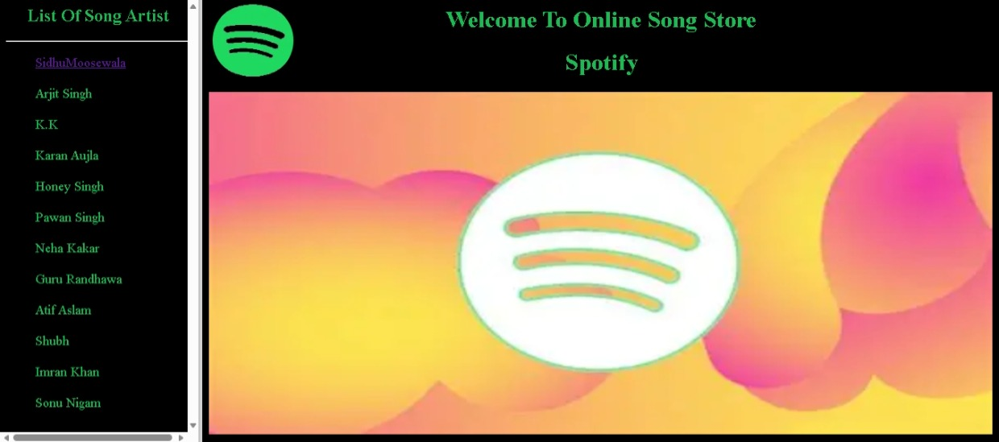
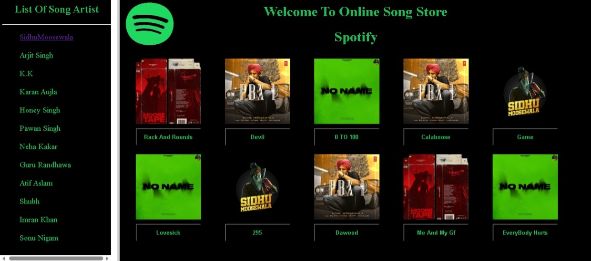
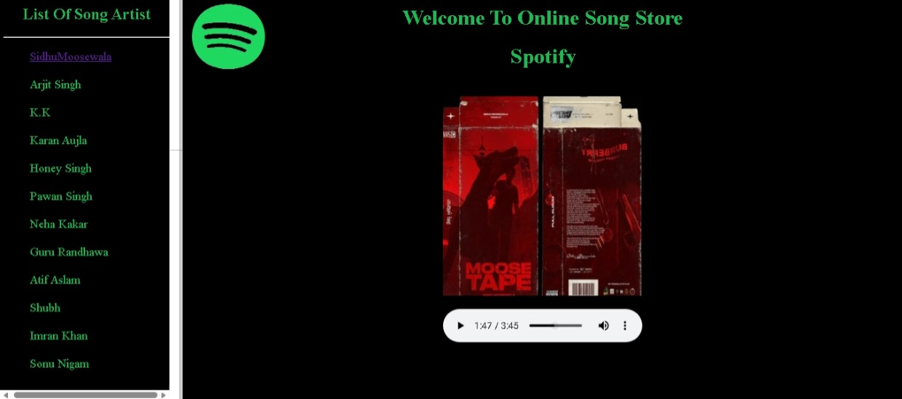

# 🎵 Song Player Website

A simple and interactive **music player website** built using HTML and CSS.  
This project allows users to view songs and play audio directly in the browser.

## 🌐 Live Demo
👉 https://ace09arabh.github.io/song_temp/

---

## 📌 Features

- 🎧 Play songs using embedded audio player  
- 🖼️ Attractive UI with images  
- 🎨 Styled using CSS  
- 🧭 Simple navigation between pages  
- ⚡ Fast and lightweight  

---

## 🛠️ Technologies Used

- HTML
- CSS

---

## 🚀 How to Run Locally

1. Download or clone the repository  
2. Open `index.html` in your browser  
3. Click on songs to play 🎵  

---

## 🎯 Learning Purpose

This project was created to practice:

- HTML structure  
- CSS styling  
- Embedding audio files  
- Basic web design  

---

## 🔮 Future Improvements

- Add JavaScript for advanced controls  
- Create playlist system  
- Add responsive design for mobile  
- Improve UI with animations  

---

## 👨‍💻 Author

**Arabh Srivastav**  
🎓 BCS Student  

---

## 📂 Project Structure

song_temp/

│── index.html

│── a1.html

│── a2.html

│── a3.html

│── rckNrnds.html

│── sidhu.html

│── rackNrounds.mp3

│── sm.jpeg

│── sm2.jpeg

│── sm3.jpeg

│── co.jpeg

│── README.md

## 📸 Screenshots

### 🏠 Home Page

### 📝 Song List

### 🎵 Song Player

---

## ⭐ Feedback

If you like this project, give it a ⭐ on GitHub!

